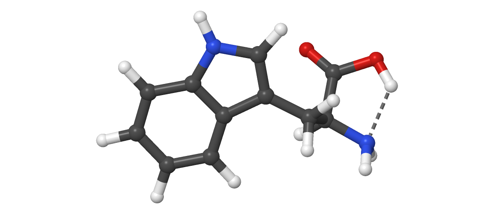

# microscope

**A molecular structure and spectroscopy viewer for quantum chemistry**, with
CYLview-style rendering. It reads the files your calculations write — Gaussian,
ORCA and Q-Chem outputs, `xyz`, `pdb`, `fchk`, Molden and cube files — and turns
them into 3-D structures, interactive spectra, editable geometries,
ChemDraw-style Lewis structures, and figures ready for a paper.

### Documentation: **[lucienwb.github.io/microscope](https://lucienwb.github.io/microscope/)**



## Install

Python 3.10 or later, on Windows, macOS or Linux:

```bash
git clone https://github.com/lucienwb/microscope
cd microscope
pip install -e .
```

That installs the `scope` command. It needs only `numpy`, `scipy`, `matplotlib`,
`pandas`, `PySide6` and `PyOpenGL`, and every file parser is written in-house.

## Use

**Open the viewer**

```bash
scope mycalc.log
```

Drag to turn it, scroll to zoom, press `V` for the other style. Every key is on
the [keyboard reference](https://lucienwb.github.io/microscope/reference/keyboard/).

**Make a figure without opening anything**

```bash
scope -s mycalc.log -o figure.png --style houk --view 30,-15
scope -s freq.log --ir -o ir.pdf
scope -s mol.log --lewis -o scheme.cdxml
```

`-s` renders and exits, like `gnuplot`, so figures regenerate from a script.
Every flag is on the [command-line reference](https://lucienwb.github.io/microscope/reference/command-line/).

**Use it from Python**

```python
import microscope

result = microscope.load("mycalc.log")
print(result.molecule.formula(), result.scf_energies[-1])
```

See the [Python API](https://lucienwb.github.io/microscope/reference/python-api/).

## What it does

Each links to the page that shows it working.

- [Look at a structure](https://lucienwb.github.io/microscope/guide/viewing/) — the CYLview render or the Houk style, labels, axes
- [Your own style](https://lucienwb.github.io/microscope/guide/style/) — edit it live, save it, share one look across a group
- [Measure](https://lucienwb.github.io/microscope/guide/measuring/) — distances, angles and dihedrals, drawn the way a paper draws them
- [Move and edit](https://lucienwb.github.io/microscope/guide/editing/) — drag a fragment along an axis or turn it, with undo
- [Mixed representations](https://lucienwb.github.io/microscope/guide/representations/) — ball-and-stick where it matters, lines elsewhere
- [Lewis structures](https://lucienwb.github.io/microscope/guide/lewis/) — flat, ChemDraw-style, out to `.cdxml`, `.mol`, SVG or PDF
- [Orbitals and densities](https://lucienwb.github.io/microscope/guide/orbitals/) — cube files as isosurfaces
- [Trajectories and vibrations](https://lucienwb.github.io/microscope/guide/trajectories/) — scans played back, normal modes animated
- [Spectra](https://lucienwb.github.io/microscope/guide/spectra/) — IR, UV-Vis and NMR; click a band to see the mode

Supported [file formats](https://lucienwb.github.io/microscope/reference/formats/) · [How it works](https://lucienwb.github.io/microscope/about/how-it-works/) ·
[Development](https://lucienwb.github.io/microscope/about/development/) · [Changelog](https://lucienwb.github.io/microscope/about/changelog/)

## Acknowledgments

- The rendering style is inspired by **CYLview** (C. Y. Legault, Université
  de Sherbrooke) — this project is an independent implementation.
- Parser test fixtures in `tests/data/` come from the **cclib** project's
  test suite (BSD-3-Clause); see `tests/data/README.md`.
- Much of the code was written with **[Claude Code](https://claude.com/claude-code)**
  (Anthropic). The chemistry, the design decisions and the review are the
  maintainer's.

## License

MIT
