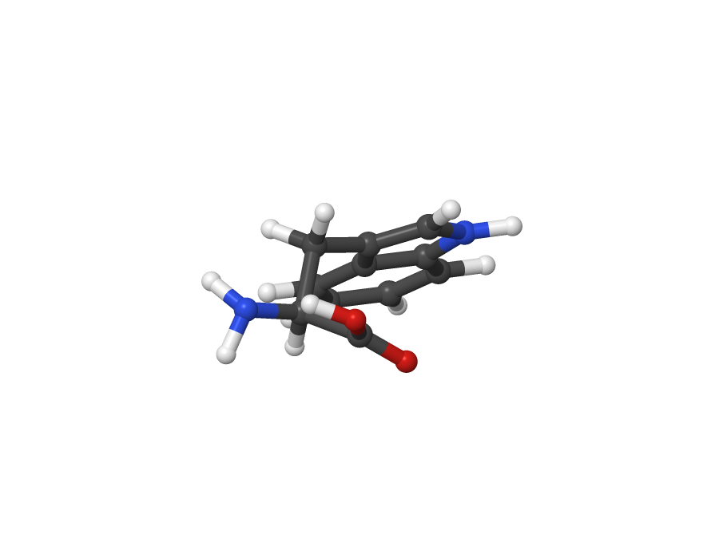
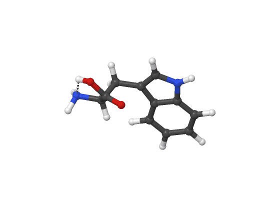
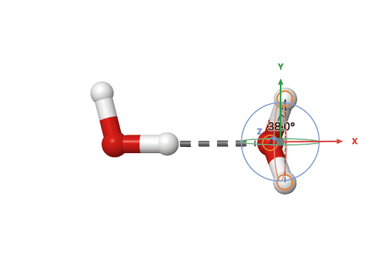
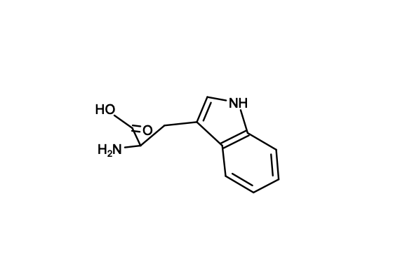
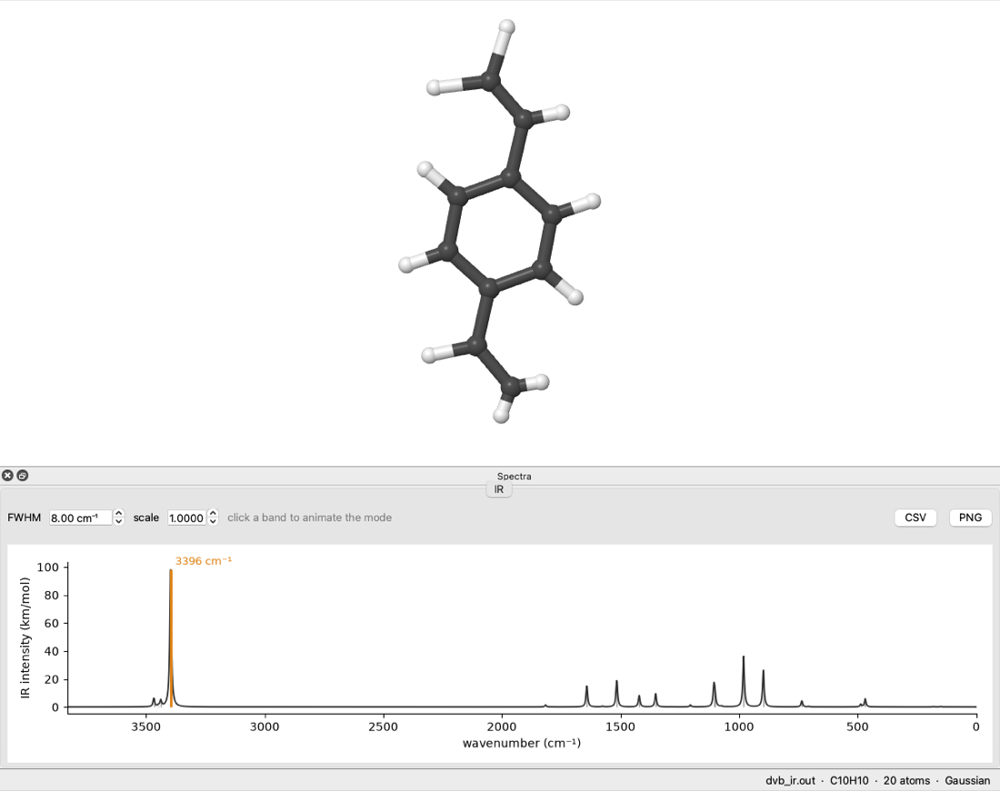

# microscope

**microscope** is a cross-platform molecular **structure and
spectroscopy viewer** for quantum chemistry, with CYLview-style
publication-quality rendering. It installs the short command `scope`.

It reads the everyday files of computational chemistry — Gaussian, ORCA and
Q-Chem outputs, `xyz`, `pdb`, `fchk`, Molden — and turns them into clean 3D
structures, interactive IR/UV-Vis/NMR spectra, editable geometries, and
figures ready for a paper.

**Documentation: [lucienwb.github.io/microscope](https://lucienwb.github.io/microscope/)**
— a guide with an animation of each feature, and references for every key,
flag, style-file key and file format.



## What it does

Every row links to the section that shows it working.

| | |
|---|---|
| [**Turn it**](#turning-and-framing) | rotate, pan, zoom, look down a bond, into a plane |
| [**Two looks**](#two-looks) | the CYLview render, or the Houk (Houkmol) ball-and-stick |
| [**Your own look**](#your-own-style) | a style you edit and save, shared by the viewer and the shell |
| [**Label it**](#labels-and-axes) | element, number, both; a corner XYZ triad |
| [**Measure it**](#selecting-and-measuring) | distances, angles, dihedrals, drawn the way a paper draws them |
| [**Move it**](#moving-atoms-by-hand) | drag a fragment along an axis or turn it, with undo |
| [**Detail where it matters**](#mixed-representations) | ball-and-stick here, sticks there, lines for the rest |
| [**Draw it flat**](#lewis-structures) | ChemDraw-style Lewis structures, out to `.cdxml`, `.mol`, SVG |
| [**Orbitals**](#orbitals-and-densities) | cube files, live isovalue and colours |
| [**Watch it move**](#trajectories-and-vibrations) | optimizations and IRCs, and normal modes animating |
| [**Spectra**](#spectra) | IR, UV-Vis, NMR — click a band to see the mode |
| [**From a script**](#the-command-line) | `scope -s` renders figures with no window, like gnuplot |
| [**From Python**](#python-api) | the parsers and writers, with no graphics attached |

It reads Gaussian, ORCA and Q-Chem outputs (recognized by content, not
extension), `xyz`, `pdb`, `fchk`, Molden and cube files, with every parser
written in-house. Structures up to about a hundred thousand atoms open in a
few seconds, so a PDB entry is as ordinary as a small molecule.

## Install

Runs anywhere Python 3.10+ runs (Windows, macOS, Linux):

```bash
git clone https://github.com/lucienwb/microscope
cd microscope
conda create -n microscope python=3.12   # or any venv
conda activate microscope
pip install -e .

scope mycalc.log                         # done
```

Dependencies are deliberately minimal and pip-installable everywhere:
`numpy`, `scipy`, `matplotlib`, `pandas`, `PySide6`, `PyOpenGL`. All file
parsers are written in-house; if `cclib` happens to be installed it is used
automatically as a fallback for formats the native parsers do not cover.

## Quick start

```bash
scope                 # open the viewer
scope mycalc.log      # open a file in it
scope -s mycalc.log   # no window: render mycalc.png and exit
```

## The viewer

Each thing it does, and what it looks like doing it.

### Turning and framing

Left-drag turns, right-drag pans, the wheel zooms. `A` with two atoms selected
looks straight down that bond; with three, it puts their plane in the screen.
`C` rotates about the selected atom, `Home` re-centres, `Ctrl+R` starts over.


### Two looks

`V` switches between the **CYLview** render — ray-cast spheres and cylinders,
never faceted, split-colour bonds — and the **Houk (Houkmol)** style: glossy
ball-and-stick with black bonds, near-white carbons and the quadrant seam
lines that stay readable in a black-and-white printout.


### Your own style

`Ctrl+T` edits the style live: atom size, bond width, the background, one
colour for every bond or split by atom, and a colour button for each element
that is actually in the structure.



Save it and you have a **group standard**. The same file drives the viewer and
the command line, so every figure in a paper comes out matching:

```bash
scope -s reactant.log --style ourgroup.json -o fig1.png
scope -s ts.log       --style ourgroup.json -o fig2.png
```

The file is JSON, with elements by symbol and colours as `#rrggbb`, so it
reads and edits by hand — and it only needs the keys you want to change:

```json
{
  "name": "our group",
  "atom_scale": 0.42,
  "bond_color": "#1a1a1a",
  "palette": {"C": "#4d4d4d", "N": "#2f5fd0", "O": "#d13b2e"}
}
```

### Labels and axes

`L` cycles the atom labels — element, element+number, number, off.


`Shift+A` puts a triad of the world axes in the corner. It turns with the
molecule, and it is included in exported images.


### Selecting and measuring

Click atoms to build a selection of any size; click one again to drop it,
click empty space or press `Esc` to clear. While two, three or four atoms are
selected the distance, angle or dihedral is shown live and drawn the way a
paper draws it — the distance written along the bond, the angle marked with an
arc at the vertex, the dihedral with a rotation arrow around the central bond.


`M` pins the current measurement into the scene so it stays while you pick the
next one (`Shift+M` clears them); pinned measurements are exported with the
figure. Larger selections just report the count, ready for the region
commands below.


### Moving atoms by hand

A manipulator sits on whatever is selected. Drag the red, green and blue
**arrows** to slide it along x, y or z, the matching **rings** to turn it about
that axis, or the **centre dot** to move it in the plane of the screen. Hold
`Shift` to snap to 0.1 Å and 15°. `F` first grows the selection to the whole
connected fragment, so a ligand or a substituent is picked up in one
keystroke, and `G` hides the handles when they are in the way. Everything is
undoable.



For an exact change rather than a dragged one, select 2–4 atoms and press `E`:
a dialog sets the distance, angle or dihedral with live preview, and the
attached fragment moves with it (ring bonds move only the end atom). `X`
deletes the selection, `B` recomputes bonds after a large change.

### Mixed representations

Select a region and give it its own level of detail with `1`, `2` and `3` —
ball-and-stick for the part that matters, sticks for the surroundings, thin
lines for the rest. With nothing selected the whole molecule switches.


### Lewis structures

`Shift+L` redraws the molecule flat and skeletal the way ChemDraw does: bare
carbon vertices, `OH` and `NH₂` labels with the hydrogens folded in, double
bonds with the second line inside the ring, formal charges. It shares the
camera with the 3-D view, so **turning it is how you choose the angle the
drawing is made from** — drag to turn, `Shift`+drag to spin it in the plane of
the page. The mode is deliberately read-only, because picking the angle is all
it is for.



Four toggles decide what it shows: every hydrogen or only the folded ones,
labelled carbons, lone-pair dots, and coloured heteroatoms.


Export it as PNG or TIFF, as **SVG or PDF** (it is line art, so it stays line
art), or `Ctrl+Shift+S` to write a **ChemDraw CDXML** or an **MDL molfile** at
the angle on screen, carrying the bond orders, charges and implicit hydrogens,
ready to rearrange in ChemDraw.

Bond orders and charges are worked out from the geometry, and that cannot
always be right — a carbocation and a carbanion have the same connectivity,
and a metal complex has no Lewis structure at all. A charge the file declares
but the drawing cannot put on any atom goes on square brackets round the whole
structure, the way a delocalized radical cation is drawn. Where it still
cannot be sure, the drawing says so rather than inventing an answer: the
perceived charge disagreeing with the file, a metal whose surrounding charges
are only bookkeeping, atoms stacked behind each other in this view (which just
means: turn it).

### Orbitals and densities

Open a `.cube` file from `cubegen`, `orca_plot` or anywhere else and the
surface appears. `I` opens live controls — isovalue, opacity, a colour for
each lobe from curated pairs or any RGB/HEX value, and which orbital to show
for a multi-MO cube.


### Trajectories and vibrations

An optimization, IRC or scan plays back geometry by geometry, with the energy
of each.


Open a frequency job and the spectra panel appears (`S`). **Click an IR band
and the molecule walks through that normal mode** — click again or press
`Space` to stop.


## Keyboard reference

Everything the viewer does, in one place. Every entry is also in the menus.

### Looking

| Key | What it does |
|---|---|
| left-drag / right-drag / scroll | rotate · pan · zoom |
| `V` | CYLview look ⇄ Houk (Houkmol) ball-and-stick |
| `1` `2` `3` | ball & stick · stick · line, for the selection (or all of it) |
| `L` | cycle atom labels: element → element+number → number |
| `Shift+A` | corner XYZ axis triad |
| `A` | align the view: down the bond (2 atoms) or into the plane (3 atoms) |
| `C` · `Home` · `Ctrl+R` | rotate about the selected atom · re-centre on the molecule · reset the view |
| `H` | hydrogen bonds (shown by default as dashed lines) |
| `S` · `Space` | show/hide the spectra panel · stop a vibration animation |

### Selecting, measuring, editing

| Key | What it does |
|---|---|
| click · click again · `Esc` | add an atom to the selection · remove it · clear |
| *(2–4 atoms selected)* | the distance / angle / dihedral is shown live |
| `M` · `Shift+M` | pin the measurement into the scene · clear the pinned ones |
| `F` | grow the selection to the whole connected fragment |
| `G` | show/hide the move-rotate handles |
| `E` | adjust the selected distance/angle/dihedral, with live preview |
| `X` | delete the selected atoms |
| `B` | recompute bonds after a large geometry change |
| `Ctrl+Z` · `Ctrl+Y` | undo · redo (the platform's standard keys) |

### Drawing and saving

| Key | What it does |
|---|---|
| `Shift+L` | Lewis structure mode (read-only; drag turns, `Shift`+drag spins) |
| `I` | isosurface controls: isovalue, opacity, colours, which MO |
| `Ctrl+T` | the style editor — colours and sizes, live, savable as a file |
| `Ctrl+E` | Export Image — PNG/TIFF, and SVG/PDF in Lewis mode |
| `Ctrl+Shift+S` | Save for ChemDraw — `.cdxml` or `.mol` at the angle on screen |
| `Ctrl+O` · `Ctrl+S` | open · save as (`xyz`, `.gjf`, `.inp`, `.in`, `pdb`, `.mol`) |

## The command line

`-s`/`--silent` turns microscope into a batch plotter, the way `gnuplot` makes
a plot from a script: no window opens, the figure is written, the command
returns. Put the line in a Makefile and every figure regenerates itself after
a re-optimization.

```bash
scope -s opt.log -o fig.tif --style houk --size 2000x1500
scope -s mol.xyz --view top --labels number --measure 3,4
scope -s mol.log --rep '1-12:ball;13-40:line' --view 30,-15 --axes
scope -s homo.cube --iso 0.03 --iso-colors purple,gold --zoom 1.3
scope -s scan.log --frame 12 --align 3,4 -o frame12.png
```

`--ir`, `--uv` and `--nmr` plot the spectrum instead of the molecule, with the
same broadening and axes as the spectra dock, and vector output for journals:

```bash
scope -s freq.log --ir -o ir.pdf --fwhm 12 --freq-scale 0.965
scope -s freq.log --ir --xrange 600:1800 --title 'fingerprint region'
scope -s td.log   --uv --unit eV --xrange 2:7 -o uv.svg
scope -s nmr.log  --nmr --nucleus C --reference 186.4 --csv shifts.csv
```

`--lewis` draws the flat structure, and `-o` decides what comes out — a
picture, vector art, or a structure file:

```bash
scope -s mol.log --lewis --align 2,3,4 -o scheme.svg
scope -s mol.log --lewis -o mol.cdxml        # opens in ChemDraw at that angle
scope -s mol.log --lewis --lone-pairs --color-atoms -o lewis.png
```

Writing a `.cdxml` or `.mol` needs no graphics library at all, and `--ir`
loads only matplotlib — neither starts Qt.

### Flags worth knowing

| Flag | |
|---|---|
| `-o FILE` | output; the extension picks the format. Default: the input's name |
| `--style NAME\|FILE` · `--rep SPEC` | `cylview`, `houk`, or a style file saved from the viewer; and per-region detail (`'1-12:ball;13-40:line'`) |
| `--view NAME` · `--rotate X,Y` · `--align A,B[,C]` | named view · turn by degrees · look down a bond or into a plane |
| `--zoom` · `--size WxH` · `--supersample N` | framing and resolution |
| `--labels MODE` · `--measure A,B[,C[,D]]` · `--axes` | annotations drawn into the figure |
| `--cube FILE` · `--iso VALUE` · `--iso-colors A,B` · `--iso-opacity` · `--mo N` | a cube's isosurface: which file, what level, lobe colours, and which orbital |
| `--frame N` | which geometry of a trajectory |
| `--opaque` · `--background COLOR` | fill the background instead of leaving it transparent |
| `--bond-color COLOR` · `--no-hbonds` | one colour for every bond · hide the dashed hydrogen bonds |
| `--fwhm` · `--freq-scale` · `--unit` · `--xrange` · `--nucleus` · `--reference` | spectrum shape and axes |
| `--no-sticks` · `--csv FILE` · `--dpi` · `--title` | spectrum extras |
| `--show-hydrogens` · `--carbon-labels` · `--lone-pairs` · `--color-atoms` | what the Lewis drawing shows |
| `--spin DEG` | turn the picture in the plane of the page |

`scope --help` is the full list. Atom numbers are 1-based, exactly as the
viewer labels them. `--style`, `--labels`, `--axes` and `--lewis` also work
without `-s`, to open the viewer already set up that way; the render-only
flags are refused in GUI mode rather than silently ignored.

## Supported files

| Format | Read | Write |
|---|---|---|
| XYZ (single & multi-frame) | ✅ | ✅ |
| Gaussian output (`.log`/`.out`) | ✅ geometries, SCF energies, frequencies + IR + normal modes, TD-DFT, NMR shieldings | — |
| Gaussian input (`.gjf`/`.com`) | ✅ | ✅ |
| Gaussian formatted checkpoint (`.fchk`) | ✅ | — |
| ORCA output (`.out`) | ✅ geometries, energies, frequencies + IR + normal modes, TD-DFT absorption, NMR shieldings | — |
| ORCA input (`.inp`) | — | ✅ |
| Q-Chem output (`.out`) | ✅ geometries, energies, frequencies + IR + normal modes, TD-DFT | — |
| Q-Chem input (`.in`/`.qcin`) | — | ✅ |
| Molden (`.molden`) | ✅ geometries, frequencies + normal modes | — |
| Cube (`.cube`/`.cub`) | ✅ geometry + volumetric MO/density grids (incl. multi-MO) | — |
| PDB | ✅ | ✅ |
| MDL molfile (`.mol`/`.sdf`) | — | ✅ 3-D, or the flat drawing with bond orders |
| ChemDraw (`.cdxml`) | — | ✅ the flat drawing at the angle on screen |

Program outputs are recognized by content, not extension — any `.log`/`.out`
file is sniffed and routed to the right parser. If `cclib` is installed it
serves as a fallback for anything the native parsers miss.

## Spectra

Open any frequency / TD-DFT / NMR job and the spectra panel appears
automatically (`S` toggles it):

- **IR** — Lorentzian-broadened spectrum with sticks; adjustable FWHM and
  frequency scaling factor. **Click a band and the 3D structure animates that
  vibrational mode** (click again or press Space to stop).
- **UV-Vis** — Gaussian broadening in the energy domain; nm or eV axis;
  oscillator-strength sticks on a secondary axis.
- **NMR** — per-nucleus spectrum (¹H, ¹³C, …); enter a reference shielding σ₀
  to switch from raw shieldings to the chemical-shift (δ) scale.

Every spectrum exports as CSV (data) or PNG/SVG/PDF (figure) for publications.



## Roadmap

Done: the viewer, native Gaussian/ORCA/Q-Chem/Molden parsers, trajectory
playback, IR with mode animation, UV-Vis and NMR, geometry editing with undo,
input writers, hydrogen bonds, cube isosurfaces, the Houk style, mixed
representations, the manipulator, Lewis structure mode, and the `scope -s`
command line.

Next: a style editor, and a PyPI release once the distribution name is
settled (`microscope` and `scope` are both taken).

Computing MO/density grids from basis sets was considered and **rejected** —
this draws what quantum-chemistry programs produced, and never computes
chemistry itself.

## Python API

Reading files and everything derived from them is scriptable, and importing
`microscope` starts no graphics — a script that only wants numbers never pays
for Qt:

```python
import microscope

result = microscope.load("mycalc.log")      # any supported format
mol = result.molecule                        # final geometry
print(mol.formula(), result.scf_energies[-1])

for v in result.vibrations[:3]:
    print(v.frequency, v.ir_intensity)

lewis = microscope.perceive(mol)             # bond orders, charges, lone pairs
print(lewis.total_charge, lewis.matches_file)

microscope.save_molecule("next_job.gjf", mol)
```

`microscope.__all__` is the supported surface; anything else is internal.
`examples/api_demo.py` is a fuller tour (trajectories, IR, TD-DFT, NMR,
format conversion).

## Development

```bash
pip install -e ".[dev]"
pytest                            # 247 tests, headless, no display needed
ruff check microscope tests scripts
mypy
python scripts/preview.py         # offscreen render smoke test
python scripts/record_demo.py lewis   # regenerate the README animation
```

Tests run headless on all three platforms via GitHub Actions and cover the
parsers, the geometry engine, editing, Lewis perception and the spectra
models. `scripts/record_demo.py orbit vibrate` records the 3-D clips too, but
needs a working OpenGL 3.3 driver.

## Acknowledgments

- The rendering style is inspired by **CYLview** (C. Y. Legault, Université
  de Sherbrooke) — this project is an independent implementation.
- Parser test fixtures in `tests/data/` come from the **cclib** project's
  test suite (BSD-3-Clause); see `tests/data/README.md`.
- Much of the code was written with **[Claude Code](https://claude.com/claude-code)**
  (Anthropic). The chemistry, the design decisions and the review are the
  maintainer's.

## License

MIT
