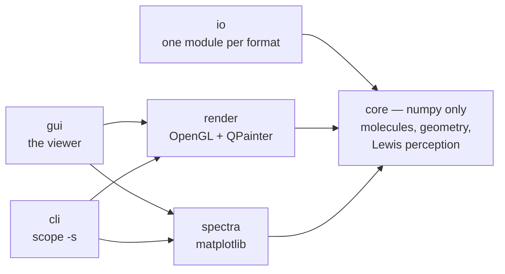

# How it works

microscope **draws what quantum-chemistry programs produced; it never computes
chemistry itself.** A structure is shown as the file gives it, an orbital is the
program's own coefficients in the program's own basis set, and even the Lewis
structure is perceived from the geometry rather than recalculated. That rule
decides most of what follows.

## The layers

Dependencies only point inward. `core`, `io` and `spectra` never import Qt or
OpenGL, which is why `import microscope` is fast and a script can read a
calculation on a machine with no display at all.

## Rendering

Spheres and cylinders are **ray-cast impostors**: each atom is a flat square
facing the camera, and the fragment shader works out, pixel by pixel, where a
ray would hit a true sphere. Nothing is tessellated, so an atom is perfectly
round at any zoom and a hundred thousand of them cost little. The camera is
orthographic, so lengths on screen are lengths in the molecule.

Isosurfaces are the exception — they are triangle meshes, extracted by marching
tetrahedra. Each vertex sits on an edge between two grid points, and its normal
is the field's gradient at those two points, interpolated as the vertex is, so
no gradient of the whole grid is ever made. They are translucent, so they are
drawn with a depth pre-pass: only the nearest layer is shaded, and the back of
the surface does not show through as noise.

## Orbitals

An orbital from an fchk or Molden file is a sum of Gaussians, and putting it on
a grid is arithmetic, the same `cubegen` does. The hard part is reading the file
the way its program meant it.

- **Conventions are folded in once.** Component order, normalization, pure
  versus Cartesian functions, and any flipped signs become one small matrix per
  shell when the file is read, so the evaluator only ever sees bare Cartesian
  Gaussians.
- **The file checks the reading.** A program's orbitals are orthonormal in its
  own basis, so CᵀSC = I, with S the overlap matrix worked out analytically,
  holds only if every convention was read as meant. Every Gaussian fchk in the
  test corpus passes to 10⁻⁷ over all its orbitals, virtuals included. For
  Molden files, where programs disagree, each plausible reading is scored and
  the best one kept: all 29 test files from seven programs are recognized.
  That is how Turbomole's habit of scaling d, f and g functions by 3, 15 and 105
  was found, rather than looked up.
  Checking takes a spread of up to 600 orbitals and never holds the overlap
  matrix itself, only one block of it at a time, so memory stays small at any
  basis size.
- **A shell is evaluated only where it matters.** On an axis-aligned grid a
  Gaussian factorizes into one factor per axis, so each shell is built from
  1-D arrays and joined with one matrix product, over only the box where it can
  still contribute 10⁻⁶ to this orbital. A 100-atom complex with 750 basis
  functions takes 0.13 s on a four-million-point grid, and agrees with the
  point-by-point formula to 10⁻⁶. The box grows when an orbital is still
  above 0.005 at its walls, which about one frontier orbital in six needs.
- **Big files stay cheap to open.** The millions of coefficient lines in a
  large file are found by searching for the few lines that are not numbers,
  and parsed in blocks: a 1600-function ORCA Molden file opens in 0.7 s,
  wavefunction check included.

## Lewis perception

A Lewis structure is worked out from bond lengths. Every pair of elements has
known single, double and triple lengths, so each bond has an order it would
like; those wishes are then reconciled with the valence each atom has left.

Getting that right is harder than it sounds, and most of the rules exist
because a simpler version failed on something real:

- **Greedy assignment strands atoms.** Handing out double bonds one at a time
  can leave two atoms of a six-ring with no partner, drawing benzene with two
  double bonds and two carbanions. Ties go to the most constrained bond, and
  anything still stranded — fused rings from tetracene on — is rescued by
  flipping an alternating chain of bonds.
- **Triples lose to doubles.** Doubles are handed out first, which is what
  makes CO₂ two double bonds, but it spent a nitrile carbon's last valence on
  the ring bond beside it. A bond that plainly wants a triple now claims its
  valence first, where both atoms can afford every triple they want.
- **Coordinated CO is stretched.** Back-donation lengthens a metal carbonyl to
  1.13–1.18 Å, so the reference triple length is set at 1.15 rather than free
  CO's 1.128, or it reads as a ketone.

Charges then follow the rules described in the
[Lewis guide](../guide/lewis.md): a charge the file states is placed on an atom
or on brackets; metal complexes use ionic counting, so the metal carries its
oxidation state; and a structure with no hydrogens claims no charges at all.

All of it was checked against a corpus of 626 files from 19 programs — the cclib
test suites, RCSB, the tmQM set of transition-metal complexes, PubChem — where
every one of the 442 structures that can be drawn reconciles with the charge
its file states.

## Scale

Two things let a protein open as easily as a small molecule.

**Bonds through a grid.** Comparing every pair of atoms needs an N×N array —
hundreds of gigabytes for a crystal structure. Atoms are binned into cells one
bond-length wide, and only neighbouring cells are compared. Photosystem II, at
54,000 atoms, went from running out of memory to a tenth of a second.

**Arrays, not objects.** Perception works on whole arrays — bond lengths in one
call, bonds grouped by element pair so reference lengths are looked up once per
pair, valence and charge from tables indexed by atomic number. Results are
stored as narrowly as the data allows: bond orders and charges in single
bytes, the bond network as two integer arrays rather than a list per atom.

Two faster-looking ideas were measured and rejected. scipy's KD-tree finds the
same bonds 1.4× faster but costs more to import than it saves; and comparing
only half of each cell's neighbourhood made bond perception 3.5× *slower*,
because one large numpy operation beats fourteen small ones.
