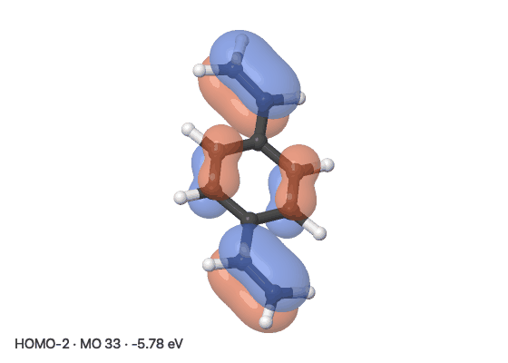
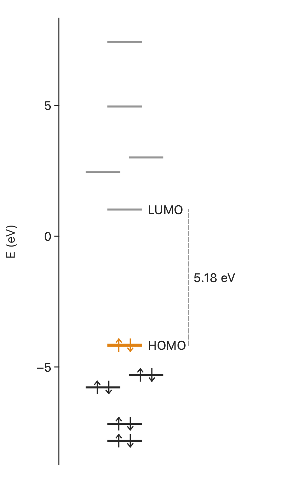

# Orbitals and densities

## From a wavefunction file

Open an `.fchk` or `.molden` file (ORCA's `name.molden.input` too) and press
++i++. The orbitals are listed with their energies and occupations, the HOMO is
drawn, and the arrow keys step through the rest.



- **Every orbital in the file**, labelled HOMO-2, LUMO+1 and so on, with the
  number the program gives it, its energy in eV and its occupation (and its
  symmetry where a Molden file gives one)
- **α and β** separately for an unrestricted wavefunction
- **Save Cube…** writes the orbital on show as a cube file, for VMD, GaussView
  or anything else

Beside the list is the **energy-level diagram**: occupied levels with their
electrons, the virtual ones in grey, degenerate orbitals side by side, and the
HOMO–LUMO gap measured, in two columns, α and β, for an unrestricted
wavefunction. Click a level to draw that orbital. **Save Levels…** writes the
diagram as PNG, SVG or PDF, ready for a figure.

{ width="300" }

The orbital is the program's own: its basis set and its coefficients, put on a
grid the way `cubegen` or `orca_plot` would. For a 100-atom complex with 750
basis functions an orbital is on screen in about half a second, and the last few
are kept, so stepping back is instant.

The grid is spaced 0.12 Å and reaches 4 Å past the outermost atoms, and further
when an orbital needs it: a diffuse virtual gets a bigger box instead of lobes
sliced flat at its walls. A molecule big enough to pass eight million grid
points gets a coarser grid instead of a slower one.

!!! note "Is the file read right?"
    Programs do not agree on what a Molden file means. ORCA, CFOUR, Turbomole
    and Psi4 each normalize some functions their own way, and ORCA flips the
    sign of some f and g functions. microscope checks its reading against the
    file itself: a program's orbitals are orthonormal in its own basis, so they
    only come out orthonormal if every convention was read as meant. It uses
    the reading that passes, and the window warns if none does. Files from
    Gaussian, ORCA, Psi4, CFOUR, Turbomole, Molpro and Molden itself are
    recognized. An fchk file is checked the same way, since programs other
    than Gaussian write them too, and flagged if it does not pass.

    If the orbitals in a file cannot be read at all, the structure still
    opens, and the status bar says what was wrong.

## From a cube file

Open a `.cube` file (from Gaussian's `cubegen`, ORCA's `orca_plot`, or anything
else that writes the format) and the orbital or density appears as an
isosurface straight away.


## The controls

++i++ opens them for either kind of file, and they apply live:

- **Isovalue**: where the surface is drawn. Orbitals start at the conventional
  |ψ| = 0.02 au, densities at 0.002
- **Opacity**
- **Colours**: curated pairs for the + and − lobes, or any RGB or hex colour
  for each
- **Which grid**, for a cube holding several

Surfaces are translucent with a depth pre-pass, so only the nearest layer is
shaded and back faces do not show through as noise. They are included when the
view is exported.

## From the command line

`--mo` names an orbital the way a paper does: `homo`, `lumo`, `homo-1`,
`lumo+2`, its number, or `beta:homo` for an unrestricted wavefunction.

```bash
scope -s mol.fchk --mo homo --iso 0.03 -o homo.png
scope -s mol.molden --mo lumo+1 --iso-colors purple,gold -o lumo1.png
scope -s mol.fchk --mo homo -o homo.cube       # the grid itself, for other programs
scope mol.fchk --mo homo                       # open the viewer showing the HOMO
```

Writing a `.cube` starts no graphics at all, so it runs on a cluster node. For a
cube file, `--mo` picks a grid by its position, since a cube says nothing about
occupations:

```bash
scope -s homo.cube --iso 0.03 --iso-colors purple,gold --zoom 1.3 -o homo.png
scope -s opt.log --cube orbitals.cube --mo 3 -o mo3.png
```
