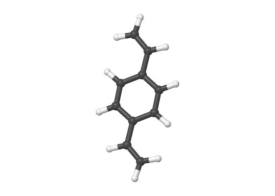

# Trajectories and vibrations

## Trajectories

An optimization, IRC or coordinate scan plays back geometry by geometry. The
frame bar at the bottom steps through them and shows the energy of each.


```bash
scope -s scan.log --frame 12 -o frame12.png     # one geometry of a trajectory
```

## Vibrations

Open a frequency job and the spectra panel appears. **Click an IR band and the
molecule walks through that normal mode.** Click again, or press ++space++, to
stop.



The amplitude is scaled so the atom that moves most swings 0.35 Å, which is
enough to see every mode and not so much that a stretch looks like a
dissociation. See [spectra](spectra.md) for the rest of the panel.
