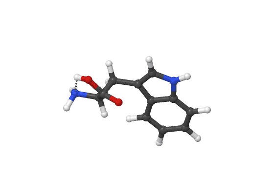
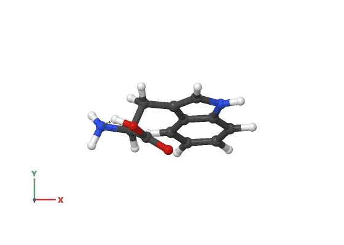

# Looking at a structure

## Turning and framing

Left-drag turns the molecule, right-drag pans, and the wheel zooms.

To get a particular view rather than a dragged one, select atoms first:

| Keys | Selection | What happens |
|---|---|---|
| ++a++ | two atoms | look straight down the bond between them |
| ++a++ | three atoms | put their plane in the screen |
| ++c++ | one atom | rotate about that atom |
| ++home++ | — | re-centre on the whole molecule |
| ++ctrl+r++ | — | reset the view entirely |

The camera is orthographic, so there is no perspective to distort lengths:
a bond the same length on screen is the same length in the molecule.

## Two looks

++v++ switches between the two built-in styles.

**CYLview** is the default: ray-cast spheres and cylinders, so nothing is ever
faceted however far you zoom, with bonds split half-and-half in the colours of
the atoms they join.

**Houk** ("Houkmol") is the Houk group's ball-and-stick: glossy, with black
bonds, near-white carbons, and two black seam lines on every heavy atom that
turn with the molecule. It stays readable in a black-and-white printout.

Neither has to be the last word — the [style editor](style.md) starts from
either and saves your own.

## Labels and axes

++l++ cycles the atom labels: element, element and number, number, and off.
Atom numbers are 1-based, matching the numbering the command line uses.

++shift+a++ puts a triad of the world axes in the corner. It turns with the
molecule, and it is included in exported images, so a figure can say which
way is which.

## Exporting

++ctrl+e++ exports the view as a high-resolution image, with the isosurface,
labels, pinned measurements and axes all included. Two formats, both chosen
because they keep a transparent background:

- **PNG** for everything, transparent by default
- **uncompressed TIFF** as a lossless master for a publisher

For the same thing without the window, see
[the command line](../reference/command-line.md).
